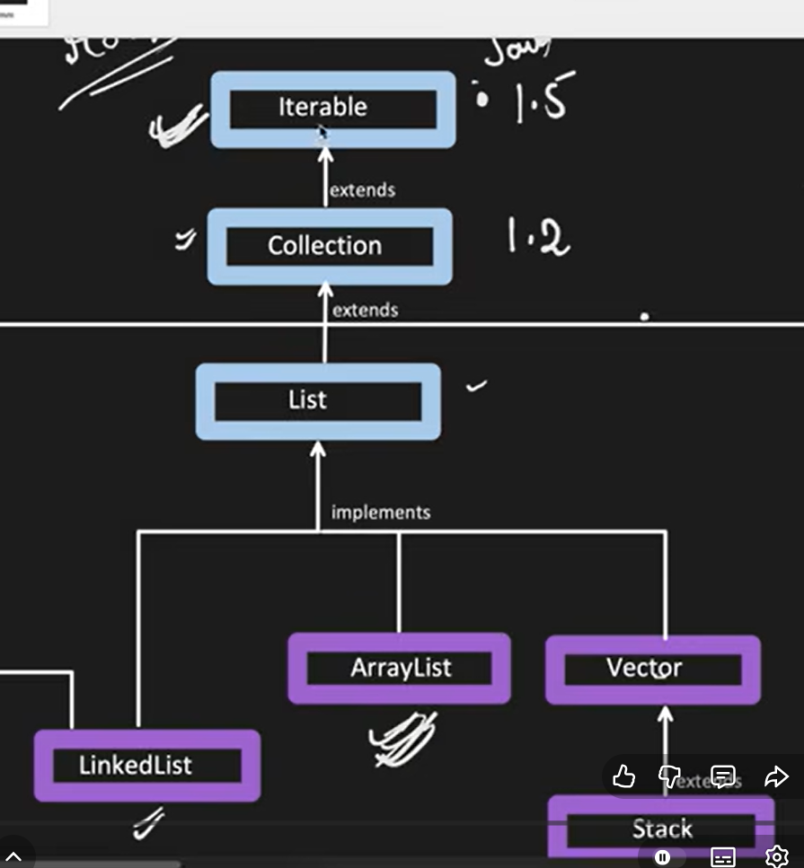
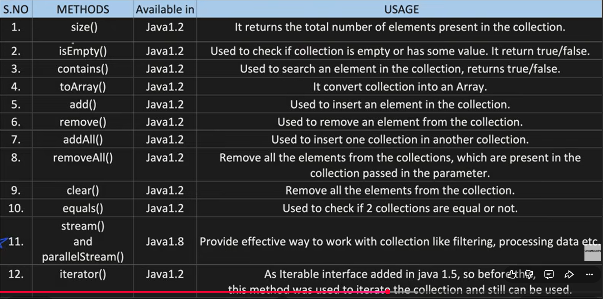

# JAVA COLLECTIONS
- Java collections will be available in java.util package.
- It was added in JDK 1.2 version.
- Before Collections, we had arrays, vectors, hashtables. But each of them have their own methods and properties. So, it was difficult to manage and remember them. To overcome this problem, Java Collections framework was introduced.
- 
- The parent class is **Iterable**. it is used to iterate through collections. It has methods like:
   - hasNext() - It will return true if the values are presnt in the collection
   - next()  - provide the number at the current index.
   - remove() - will remove the element in current index.
- Any collection under **Iterable** cab be accessed or traversed using "*for-each** loop.   
- The immideate child of **Iterable** is **Collection**(refer img above). The possible methods in collection interface flor all the collection classes(Arraylist,linkedlist ect) to use are:

## Java Collection Vs Java Collections.
- Java Collection is an interface which is the root of the collection hierarchy. It has subinterfaces like List, Set, Queue, Deque. It has methods like add(), remove(), size(), contains() etc.
- Java Collections is a utility class which has static methods to operate on collection objects. It has methods like sort(), reverse(), shuffle() etc.
- We can use our own logic as well, but Collections help us with predefined methods.

