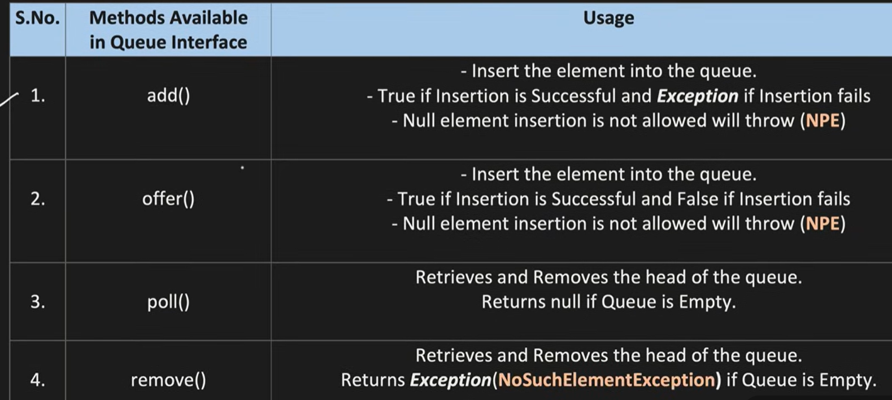
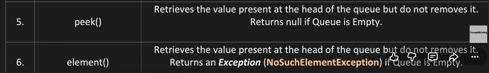
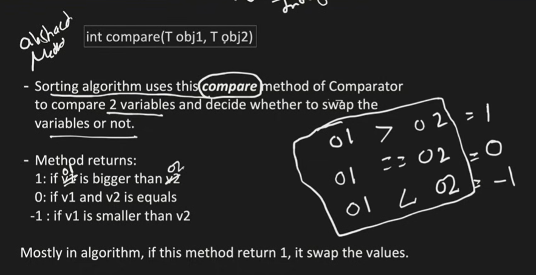

# JAVA COLLECTIONS
- Java collections will be available in java.util package.
- It was added in JDK 1.2 version.
- Before Collections, we had arrays, vectors, hashtables. But each of them have their own methods and properties. So, it was difficult to manage and remember them. To overcome this problem, Java Collections framework was introduced.
- 
- The parent class is **Iterable**. it is used to iterate through collections. It has methods like:
   - hasNext() - It will return true if the values are presnt in the collection
   - next()  - provide the number at the current index.
   - remove() - will remove the element in current index.
- Any collection under **Iterable** cab be accessed or traversed using "*for-each** loop.   
- The immideate child of **Iterable** is **Collection**(refer img above). The possible methods in collection interface flor all the collection classes(Arraylist,linkedlist ect) to use are:


## Java Collection Vs Java Collections.
- Java Collection is an interface which is the root of the collection hierarchy. It has subinterfaces like List, Set, Queue, Deque. It has methods like add(), remove(), size(), contains() etc.
- Java Collections is a utility class which has static methods to operate on collection objects. It has methods like sort(), reverse(), shuffle() etc.
- We can use our own logic as well, but Collections help us with predefined methods.

## QUEUE
- fOLLOWS FIFO approach, there are exceptions for the priority queue.
- It supports all the methods of collection interface and some additional methods like:



### Priority Queue
- It is a class that implements Queue interface. It is of two types:
   - Min Heap - The element with the lowest value will be removed first.
   - Max Heap - The element with the highest value will be removed first.
- Internally, it uses min heap and max heap data structure to store the elements.
- It follows natural ordering(for int it follows ascending order) or we can provide our own comparator to sort the elements in a specific order.
- When elements are inserted in priority queue, it follows natural order(Every parent is less than or equal to its children.), for that it will internally construct a min heap(by default, itf not type is explicitly provided.).

# Constructing a Min Heap (Short Notes)

A **Min Heap** is a **Complete Binary Tree** where every parent is **less than or equal to its children**.

## Steps to Construct

1. Insert the new element at the **end** of the heap.
2. Compare it with its **parent**.
3. If the new element is **smaller**, swap them.
4. Repeat until:
   - the parent is smaller, or
   - the element becomes the root.

This process is called **Heapify Up (Sift Up)**.

---

## Example

Insert: **10, 5, 20, 2**

### Insert 10

```text
[10]
```

### Insert 5

```text
[10, 5]
```

Since `5 < 10`, swap.

```text
[5, 10]
```

### Insert 20

```text
[5, 10, 20]
```

Since `20 > 5`, no swap.

### Insert 2

```text
[5, 10, 20, 2]
```

`2 < 10` → Swap

```text
[5, 2, 20, 10]
```

`2 < 5` → Swap

```text
[2, 5, 20, 10]
```

### Final Min Heap

```text
      2
    /   \
   5    20
  /
10
```
- Even the removed elements will be in natural order. For example, if we remove all the elements from the above min heap, the order of removed elements will be: 2, 5, 10, 20.
- as mentioned earlier, in Priority queue, fifo is not followed. It uses only min and max heap.

### So, basically, we have to use Priority Queue, when we want the heap implementation.

## Comparator and Comparable

### Problems that we need to highlight:
- Sorting an object array.

#### Comparator:

- It is a functional interface(an interface with only one abstract method and any no.of default, static and object methods) which is used to sort the objects of a class based on some specific property.
- It has an abstract method. 
- 
- Comparator's abstarct method is compare(<T>, <T>). Comparator can be implemented in 3 ways:
   - By creating a separate class that implements Comparator interface.
   - By creating an anonymous class that implements Comparator interface.
   - By using lambda expression.
- compare(<T>) is the abstract method of Comparator interface. Comparable can be implemeneted in only one way, by implementing the Comparable interface in the class whose objects we want to sort.


